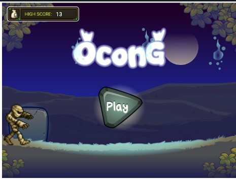
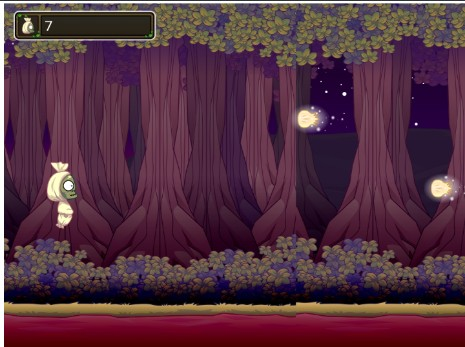

# 👻 Ocong - Hindari Kristal!

**Ocong** adalah game sederhana buatan **Samdo Dev** menggunakan Phaser 3.  
Pemain mengontrol karakter Ocong untuk **menghindari kristal** yang datang dari kanan.

🎮 **Mainkan sekarang:**  
👉 [https://sammdodev.github.io/Game-Ocong/](https://sammdodev.github.io/Game-Ocong/)

---

## 🖼️ Cuplikan Layar

<table>
  <tr>
    <td align="center">
      <b>Menu Awal</b> 
      
    </td>
    <td align="center">
      <b>Gameplay</b> 
      
    </td>
  </tr>
</table>

---

## 🎮 Cara Main

- Tekan tombol panah **Atas (↑)** untuk naik  
- Tekan tombol panah **Bawah (↓)** untuk turun  
- Hindari **kristal** yang datang dari sebelah kanan  
- Jika tertabrak kristal → Game Over

---
